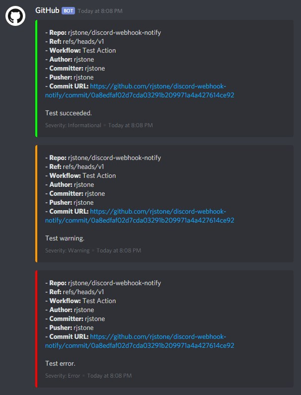
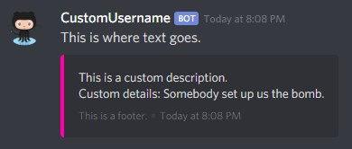

# Discord Webhook Notify

This sends a notification to discord using a webhook URL. It is written in JavaScript so **it will work with both windows and linux execution environments**.

To use this, get on Discord and create a new webhook. Then get on GitHub, go into your project settings, and add a new Secret called `DISCORD_WEBHOOK`. In your workflow YAML, set `webhookUrl` as follows: `webhookUrl: ${{ secrets.DISCORD_WEBHOOK }}`. You must set webhookUrl this way for each invocation of the action.

- Use `rjstone/discord-webhook-notify@v1` if you want bugfixes but nothing backward-compatability breaking. (If anything breaks compatability it will be in v2+.)
- Use `rjstone/discord-webhook-notify@v1.0.0` (or another specific tag after the @) if you want to guarantee use of a specific revision.

See below for more documentation and detailed examples.

## Inputs

### `webhookUrl`

The webhook URL to use. This should be in a repository secret and the secret should be included here using `${{ secrets.DISCORD_WEBHOOK }}`. For security reasons it is not possible to default this to the secret name, so it must be supplied in every action invocation.

### `severity`

The severity level of the notification, either `info`, `warn`, or `error`. Default is `error`.

### `description`

The top half of the event description. This defaults to showing a number of pieces of information from the environment. Only override this if you do not want the default selection of information. Note that this may contain Discord style markdown.

### `details`

The bottom half of the event description. If you do want the default information in the description then just specify details to add additional information below the default set of variables that are displayed. Default to empty and may contain Discord style markdown.

### `footer`

String to display in the "embed footer" section of the notification. This defaults to showing the severity level.

### `text`

String to display as normal chat text above the "embed" section. This defaults to empty and may contain Discord style markdown.

### `username`

Username to display in Discord for this notification. Default is "GitHub".

### `color`

Color of the bar on the left side of the "embed" section in the form #rrggbb (hex). Default determined by severity.

### `avatarUrl`

URL to png of discord avatar to use. The default is the GitHub monochrome "mark" logo with white background.

## Example usage

### Simple Usage Example

Set up notification for whatever conditions you want. There's no built-in handling based on reading the environment so you can notify on any `if:` expression.

```
- name: Test Success
    uses: rjstone/discord-webhook-notify@v1
    if: success()
    with:
        severity: info
        details: Test Succeeded!
        webhookUrl: ${{ secrets.DISCORD_WEBHOOK }}
- name: Test Failure
    uses: rjstone/discord-webhook-notify@v1
    if: failure()
    with:
        severity: error
        details: Test Failed!
        webhookUrl: ${{ secrets.DISCORD_WEBHOOK }}
- name: Test Cancelled
    uses: rjstone/discord-webhook-notify@v1
    if: cancelled()
    with:
        severity: warn
        details: Test Cancelled!
        webhookUrl: ${{ secrets.DISCORD_WEBHOOK }}
```

### Default Appearance Examples

This shows the appearance of notifications where most of the inputs are left at the default.



```
- name: Test Info
    uses: rjstone/discord-webhook-notify@v1
    with:
        severity: info
        details: Test succeeded.
        webhookUrl: ${{ secrets.DISCORD_WEBHOOK }}
- name: Test Warn
    uses: rjstone/discord-webhook-notify@v1
    with:
        severity: warn
        details: Test warning.
        webhookUrl: ${{ secrets.DISCORD_WEBHOOK }}
- name: Test Error
    uses: rjstone/discord-webhook-notify@v1
    with:
        severity: error
        details: Test error.
        webhookUrl: ${{ secrets.DISCORD_WEBHOOK }}
```

### Minimal Full Custom Example

This shows you where each custom input shows up in the formatting of the Discord notification.



```
- name: Test Custom
    uses: rjstone/discord-webhook-notify@v1
    with:
        severity: info
        username: CustomUsername
        color: '#ff00aa'
        avatarUrl: https://github.githubassets.com/images/modules/logos_page/Octocat.png
        description: This is a custom description.
        details: 'Custom details: Somebody set up us the bomb.'
        footer: This is a footer.
        text: This is where text goes.
        webhookUrl: ${{ secrets.DISCORD_WEBHOOK }}
```